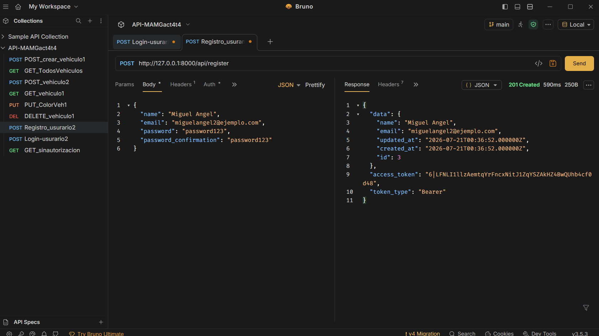
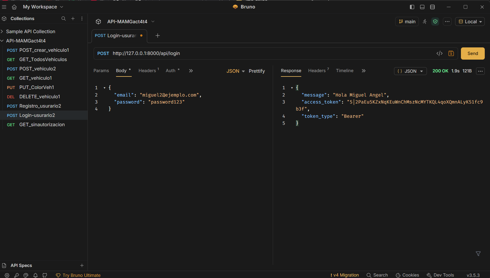
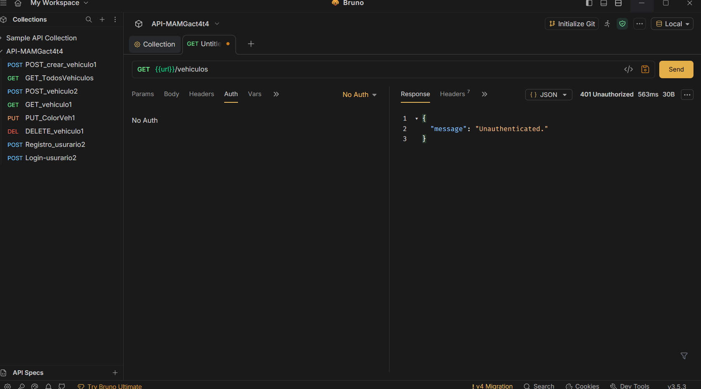
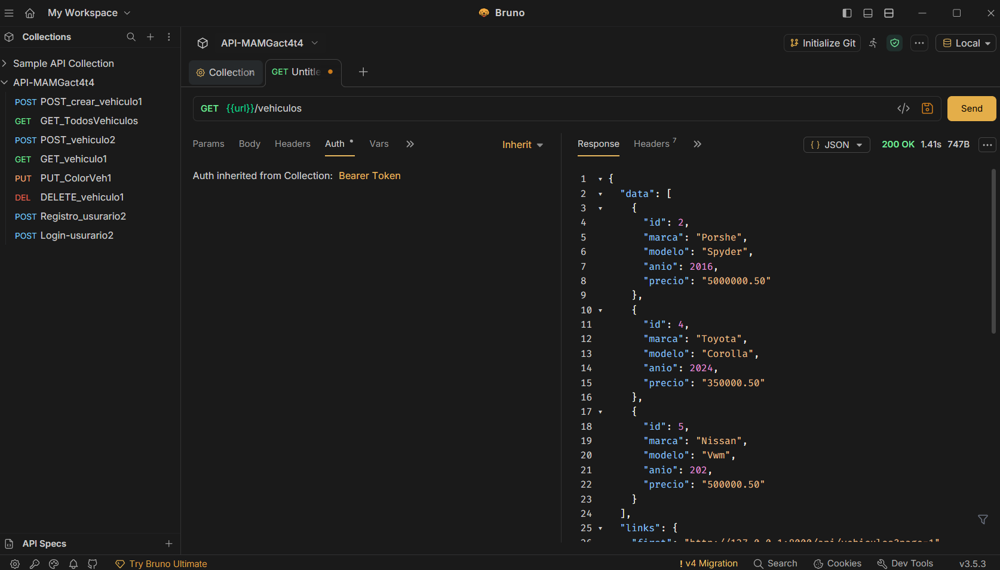
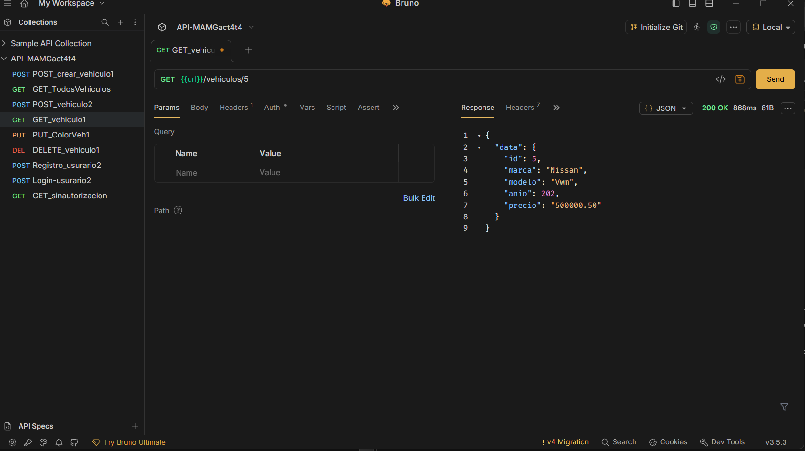
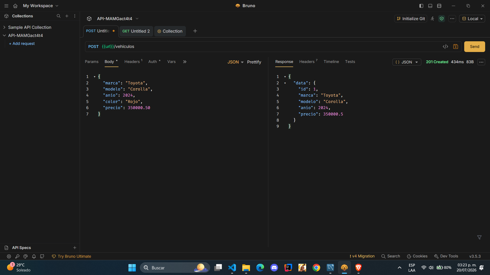
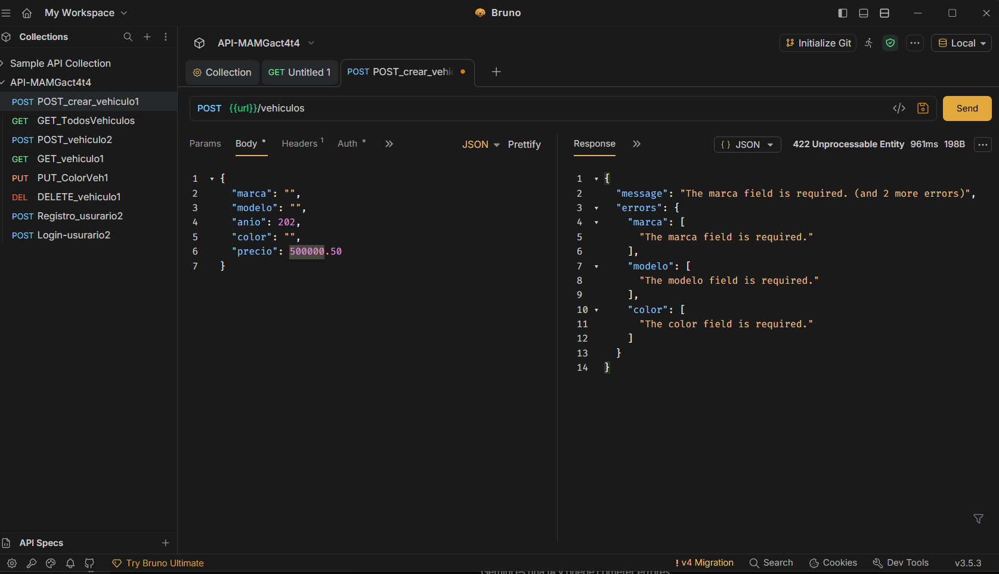
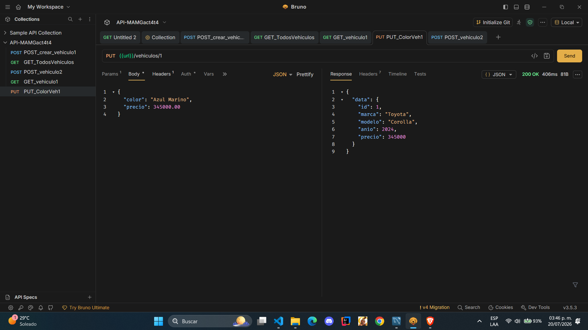
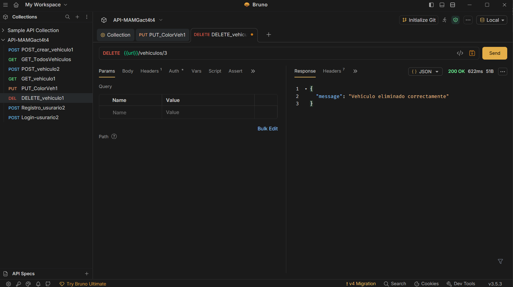

#  Act4. Actividad 4: API REST con Laravel y Autenticación con Sanctum

### TECNOLÓGICO NACIONAL DE MÉXICO/
### INTITUTO TECNOLÓGICO DE OAXACA

#### Carrera: Ingeniería en Sistemas Computacionales
#### Estudiante: Macuixtle Gaytán Miguel Angel
#### Materia: Programación Web
#### Docente: Martinez Nieto Adelina
#### Tema: 4
#### Actividad 4: API REST con Laravel y Autenticación con Sanctum
#### Fecha: 20/07/2026

## Descripción del Proyecto
Elaboracion de una API de vehiculos, en el que describe la marca, modelo, año de salida, color y precio, de igual forma necesitaras un usuario para poder hacer las consultas.

## Tecnologías Principales
* PHP 
* Framework Laravel
* Base de datos MySQL
* Laravel Sanctum 
* Bruno

---

## Pruebas de Endpoints

### Módulo de Autenticación
* **Registro de Usuario**

  
  Para registrar un usuario se necesita nombre, email, contraseña y comprobacion dela contraseña.

* **Inicio de Sesión (Login)**
  
Para entrar necesita que envies el email y contraseña y te genera un token para esa sesión.
* **Protección de Rutas (Error 401 - Sin Token)**

  
Si no tienes un token no puedes hacer peticiones.
---

### CRUD de Vehículos
* **Listar registros con paginación**

  
Listamos a los vehiculos de la pagina 2.

* **Consultar un registro individual**

  
Consultamos el vehiculo con id:5

* **Crear un nuevo vehículo (POST)**
  

* **Validación de datos (Error 422)**

  
Comprobamos que no se pueda hacer POST si hay cmapos vacios.

* **Actualizar un registro (PUT)**
  

* **Eliminar un registro (DELETE)**
  
